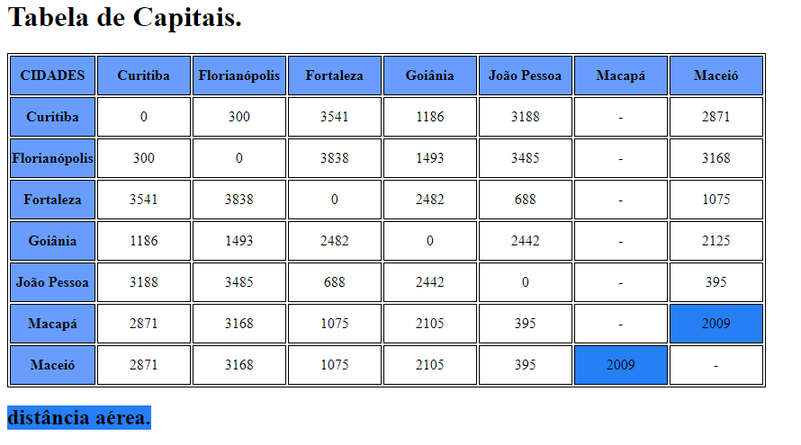

# Projeto de distâncias entre capitais brasileiras

## 📋 Sobre o projeto

 O projeto de distâncias entre capitais brasileiras foi realizado em equipes de 4 pessoas na seguinte matéria:
 * Fundamentos de desenvolvimento Web.

 ## ATENÇÃO

 * Nesse projeto há distâncias aéreas, tome cuidado para não se confundir.

 ## Como podemos utilizar esse projeto?

 Esse projeto pode ser utilizado para cálculos de distâncias entre as capitais em km.

 ## Descrição do projeto

Tabela criada nas aulas de Fundamentos de desenvolvimento web.  Nessas aulas, o professor trabalhou a distâncias entre capitais como aprendizagem de Visual Studio Code. Depois adicionamos esse projeto no Git Hub.

## Capitais constantes incluídas no projeto

As capitais utilizadas nesse projeto foram:

* Curitiba
* Florianópolis
* Fortaleza 
* Goiânia
* João Pessoa
* Maceió
* Macapá 
### ATENÇÃO 

* A distância entre Macapá e as outras cidades é aérea.

## Técnicas e tecnologias utilizadas

* Visual Studio Code
* Git 
* Git Hub
* HTML5
* CSS3

## Referências utilizadas

* [Alura](https://www.alura.com.br/artigos/escrever-bom-readme)- Como escrever um README incrível no seu Github
* [lohhans](https://gist.github.com/lohhans/f8da0b147550df3f96914d3797e9fb89)- Um modelo para fazer um bom README.md